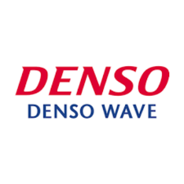
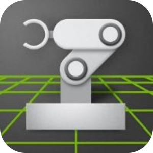
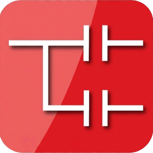
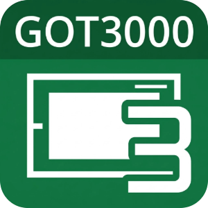
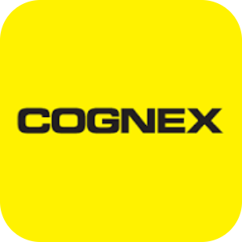
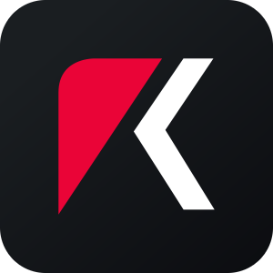
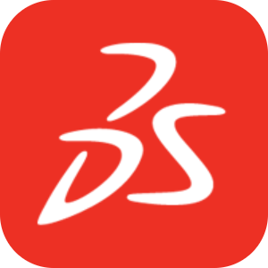
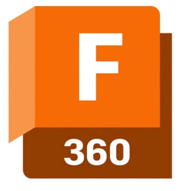
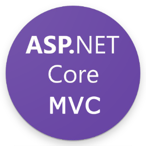

## Hi there 👋

<!--
**yuki-tech-dev/yuki-tech-dev** is a ✨ _special_ ✨ repository because its `README.md` (this file) appears on your GitHub profile.

Here are some ideas to get you started:

- 🔭 I’m currently working on ...
- 🌱 I’m currently learning ...
- 👯 I’m looking to collaborate on ...
- 🤔 I’m looking for help with ...
- 💬 Ask me about ...
- 📫 How to reach me: ...
- 😄 Pronouns: ...
- ⚡ Fun fact: ...
-->

  
  <li>I am a **Production Technology Development Engineer** in the automotive industry, working at the forefront of Factory Automation (FA). My expertise spans mechanical and electrical design, PLC control, and system integration utilizing industrial robotics.</li>
  <li>Currently, I am passionate about fusing my extensive background in control technology and FA with modern web and software engineering—including **ROS2, Computer Vision (OpenCV), and AI**—to build next-generation, intelligent automation systems.</li>

### 📊 GitHub Stats

  

  

  

<table align="center" style="border-collapse: collapse; border: none;">
  <tr style="border: none;">
    <td align="left" width="400" valign="top" style="border: none; padding: 20px;">
      <h4>🤖 Robotics & Computer Vision</h4>
      

        
        
        
        
        
        
        
      

    </td>
    <td align="left" width="400" valign="top" style="border: none; padding: 20px;">
      <h4>⚡ Embedded & Industrial</h4>
      

        
        
        
        
        
        
      

    </td>
  </tr>
  <tr style="border: none;">
    <td align="left" width="400" valign="top" style="border: none; padding: 20px;">
      <h4>📐 CAD & Design</h4>
      

        
        
        
        
        
      

    </td>
    <td align="left" width="400" valign="top" style="border: none; padding: 20px;">
      <h4>💻 Languages </h4>
      
    </td>
  </tr>
  <tr style="border: none;">
    <td align="left" width="400" valign="top" style="border: none; padding: 20px;">
      <h4>🌐 Backend & Web <em>(I'm currently learning...)</em></h4>
      

        
        
        
      

    </td>
    <td align="left" width="400" valign="top" style="border: none; padding: 20px;">
      <h4>🛠️ Tools & DevOps</h4>
      
      
    </td>
  </tr>
</table>
